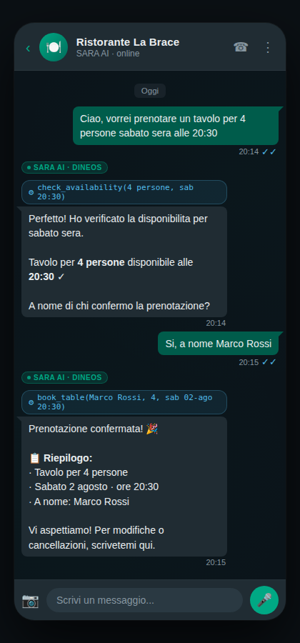
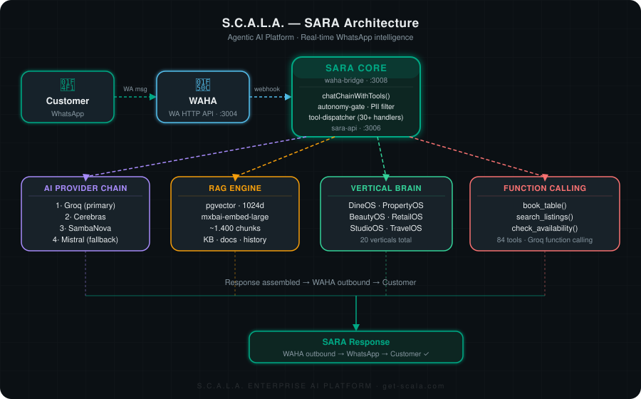

<div align="center">
<h1>SARA</h1>
<p><strong>Open-source WhatsApp AI agent with 20 industry-specific brains</strong></p>

[](https://www.gnu.org/licenses/agpl-3.0)
[](https://hub.docker.com)
[](https://www.typescriptlang.org)
[](CONTRIBUTING.md)
[](https://github.com/Alessandro114/sara)

**SARA is a self-hostable AI agent for WhatsApp that understands your industry. 20 verticals. 30+ tools. Function calling. RAG. Multi-language. Works out of the box.**

[Documentation](#configuration) · [Cloud Version](https://get-scala.com) · [Contributing](CONTRIBUTING.md)



</div>

---

## Why SARA?

- **vs Generic chatbots (Tidio, Landbot):** SARA knows your industry. A restaurant bot books tables and checks allergens. A clinic bot schedules patient appointments. Generic bots just answer FAQs.
- **vs Enterprise platforms (Salesforce, ServiceNow):** Self-host for free. No vendor lock-in. No six-figure contracts. Full source access.
- **vs Building from scratch:** 20 verticals are already wired — knowledge bases, tools, prompts, fallbacks. You add your data, not your architecture.
- **vs Other open source (Chatwoot, Typebot):** SARA is an AI agent with function calling, RAG retrieval, PII anonymization, and autonomy levels — not just a chat widget with canned replies.

---

## Features

### AI Engine

- Multi-provider LLM chain (Groq → Cerebras → SambaNova → Mistral) with automatic failover — zero downtime when one provider is rate-limited
- RAG retrieval: PostgreSQL + pgvector (1024d embeddings) + BM25 keyword fallback for hybrid search
- Function calling with 30+ tools across 20 industry verticals — agents can actually *do* things, not just respond
- PII anonymization before every external LLM call — names, phones, emails are masked at the boundary
- Prompt injection guardrails: 40+ patterns, 4 languages, evaluated before every turn
- Hallucination detection + confidence scoring on AI responses

### WhatsApp

- Voice messages: speech-to-text via Whisper
- Image understanding via vision AI
- PDF and document processing
- Location, contacts, and sticker support
- Rate limiting + anti-ban protection built in

### Industry Verticals (20)

| Vertical | Key tools |
|---|---|
| DineOS (restaurants) | Table booking, menu, allergens, price list |
| PropertyOS (real estate) | Listings, valuations, inspections |
| BeautyOS (salons) | Appointments, treatments, membership |
| MotorOS (automotive) | Test drives, service booking, trade-in |
| WellnessOS (gyms) | Class booking, membership management |
| PraxisOS (clinics) | Patient scheduling, intake forms |
| ShopOS (retail) | Product search, stock check, reservations |
| AgencyOS | Client intake, brief collection |
| StudioOS | Creative project booking, SAL generation |
| CleanOS | Cleaning service scheduling |
| TravelOS | Itinerary search, booking requests |
| NetworkOS | Event registration, networking |
| DermalyOS | Dermatology intake, appointment |
| FranchiseOS | Franchise lead qualification |
| ProjectOS | Project status, task updates |
| ReputationOS | Review collection, feedback routing |
| LandIQ | Real estate feasibility queries |
| AdOS | Campaign briefing, performance queries |
| ServiceOS | Field service scheduling |
| FacilityOS | Facility management, maintenance requests |

### Platform

- Multi-language: Italian, English, Spanish, Portuguese
- Conversation memory: history (L4) + contact profiles (L5) + RAG knowledge base (L6)
- Human takeover: AI / human / hybrid mode per conversation, switchable in real time
- Built-in dashboard: analytics, session overview, conversation logs
- Autonomy levels: OFF / OBSERVE / SEMI-AUTO / FULL-AUTO configurable per tenant

---

## Quickstart

```bash
git clone https://github.com/Alessandro114/sara.git
cd sara
cp .env.example .env
# Edit .env — minimum required: GROQ_API_KEY (free at console.groq.com)
docker compose up -d
```

- Verify: `curl http://localhost:3006/api/sara/health`
- Connect WhatsApp: open `http://localhost:3006/api/sara/qr` and scan the QR code with your WhatsApp number.

SARA is running. Send a message to the connected number.

---

## Architecture



```
Customer (WhatsApp)
    |
    v
WAHA (WhatsApp Web API)
    |
    v
SARA Core (Node.js + Fastify)
    |-- AI Provider Chain (Groq -> Cerebras -> SambaNova -> Mistral)
    |-- RAG Engine (PostgreSQL + pgvector, 1024d)
    |-- Vertical Brain (DineOS / PropertyOS / BeautyOS / ...)
    |-- Function Calling (book_table / search_listings / schedule_appointment / ...)
    |-- PII Anonymizer
    |-- Prompt Injection Guard
    |-- Memory (L4 history + L5 profiles + L6 RAG)
    |
    v
Response -> Customer
```

---

## Configuration

Key environment variables (see `.env.example` for the full list):

| Variable | Required | Description |
|---|---|---|
| `GROQ_API_KEY` | Yes | Primary LLM provider. Free at [console.groq.com](https://console.groq.com) |
| `CEREBRAS_API_KEY` | No | Fallback LLM provider |
| `SAMBANOVA_API_KEY` | No | Fallback LLM provider |
| `MISTRAL_API_KEY` | No | Fallback LLM provider |
| `DATABASE_URL` | Yes | PostgreSQL connection string (pgvector required) |
| `WAHA_URL` | Yes | WAHA instance URL (default: `http://localhost:3004`) |
| `WAHA_API_KEY` | Yes | WAHA authentication key |
| `VERTICAL` | Yes | Active vertical slug (e.g. `dineos`, `propertyos`, `beautyos`) |
| `EMBED_MODEL` | No | Embedding model — must be 1024d. Default: `mxbai-embed-large` |
| `OLLAMA_BASE_URL` | No | Ollama URL if using local embeddings |
| `SARA_AUTONOMY_LEVEL` | No | `OFF` / `OBSERVE` / `SEMI_AUTO` / `FULL_AUTO`. Default: `OBSERVE` |

> The embedding model **must produce 1024-dimensional vectors**. Changing to a different dimension silently breaks RAG retrieval. Supported: `mxbai-embed-large`, `jina-embeddings-v3`. Do not use `nomic-embed-text` (768d).

---

## Self-hosted vs Cloud

| Feature | Self-hosted (free) | Cloud ([sara.get-scala.com](https://sara.get-scala.com)) |
|---|---|---|
| AI chat engine | Yes | Yes |
| 20 industry verticals | Yes | Yes |
| Function calling (30+ tools) | Yes | Yes |
| RAG engine | Yes | Yes |
| Multi-language | Yes | Yes |
| Dashboard | Yes | Yes |
| Multi-number (multi-tenant) | No | Yes |
| White-label | No | Yes |
| Advanced analytics | No | Yes |
| Priority support | No | Yes |
| Managed infrastructure | No | Yes |

---

## Contributing

Contributions are welcome. See [CONTRIBUTING.md](CONTRIBUTING.md) for guidelines.

Good first issues are labeled [`good first issue`](https://github.com/Alessandro114/sara/labels/good%20first%20issue). If you want to add a new vertical, open an issue first so we can align on the tool schema before you build.

---

## License

SARA is licensed under [AGPL-3.0](LICENSE).

You can self-host and modify it freely. If you distribute a modified version, you must release the source code under the same license. For commercial licensing (use without AGPL obligations), contact [ale@get-scala.com](mailto:ale@get-scala.com).

---

## Built by

SARA is the AI engine behind [S.C.A.L.A. AI OS](https://get-scala.com) — an enterprise AI operating system for businesses.

Built by [Alessandro Binda](https://www.linkedin.com/in/alessandrobinda/), a GM turned AI builder with 18 years of industry experience and P&L ownership up to EUR 33M.

- Website: [get-scala.com](https://get-scala.com)
- LinkedIn: [linkedin.com/in/alessandrobinda](https://www.linkedin.com/in/alessandrobinda/)
- Twitter/X: [@alessandrobinda](https://x.com/alessandrobinda)

---

<div align="center">

If SARA helps your business, please consider giving it a star — it helps other businesses discover it too.

</div>


---

## Ecosystem

Part of the **S.C.A.L.A.** open-source ecosystem:

| Project | What it does |
|---------|-------------|
| [SARA](https://github.com/Alessandro114/sara) | WhatsApp AI agent with 20 industry-specific brains |
| [LandIQ](https://github.com/Alessandro114/landiq) | Autonomous real estate feasibility agent |
| [scala-sites](https://github.com/Alessandro114/scala-sites) | 100 vertical website templates (Next.js, MIT) |
| [scala-agent-definitions](https://github.com/Alessandro114/scala-agent-definitions) | 79 AI tool definitions for 20 verticals |
| [scala-mcp-server](https://github.com/Alessandro114/scala-mcp-server) | MCP server for Claude/ChatGPT — 250M+ companies |
| [Score SDKs](https://github.com/Alessandro114/scala-score-js) | Company data — [JS](https://npmjs.com/package/scala-score) · [Python](https://pypi.org/project/scala-score) · [Go](https://github.com/Alessandro114/company-lookup-go) · [Rust](https://github.com/Alessandro114/score-rust) · [Deno](https://github.com/Alessandro114/scala-score-deno) |
| [enrich-companies](https://github.com/Alessandro114/enrich-companies) | CSV enrichment CLI — [npm](https://npmjs.com/package/enrich-companies) · [pip](https://pypi.org/project/enrich-companies) |
| [n8n node](https://github.com/Alessandro114/n8n-nodes-scala) | n8n community node for company data |

